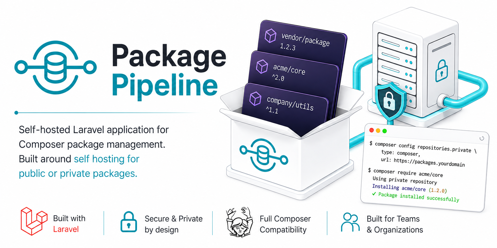

Sharing private PHP packages across projects is a chore: every consuming app
needs its own `repositories` entries, its own GitHub or GitLab credentials, and
Composer crawls the provider's API repository by repository just to resolve
versions. Package Pipeline replaces all of that with one registry you run
yourself — the one serving this page. Point it at your repositories once, and
every project can `composer require` your packages as if they were on
Packagist: one repository URL to configure, no per-repo wiring, and your code
never leaves your infrastructure.

## What you get

- **The full [Composer v2 repository API](https://getcomposer.org/doc/05-repositories.md#composer)** — `packages.json`, `search.json`, `list.json`, per-package metadata and `dist` zipballs. Consuming projects need one `repositories` entry and nothing else.
- **Syncing from GitHub and GitLab.** Tags and branches become versions; each version's zipball is stored on your own disk or S3 with its checksum, so installs are served entirely from your storage.
- **Auto-sync on push**, through a GitHub App webhook covering every repository at once, or per-repository hooks on either provider.
- **Several repositories in one installation** — a public one and an internal one, say, with independent access rules and independent tokens.
- **Access tokens with abilities**, so the token in every developer's `auth.json` can install packages without also being able to delete one.
- **Monorepo support**: several packages from one repository, each published from its own subdirectory with a re-rooted dist archive.
- **Upstream mirroring** of packagist.org or another registry, so one URL resolves a project's whole dependency graph and a build stops depending on somebody else's uptime.
- **Reserved vendor prefixes**, the server half of a dependency-confusion defence.
- **Artifact uploads** for packages built in CI rather than synced from a repository.
- **Public pages** like this one, for any package or repository you choose to describe.
- **Download analytics, a license report and a CycloneDX SBOM export.**
- **An audit log, teams, SSO, outgoing webhooks and a Prometheus endpoint** for the operational side.

## Running your own

Requires PHP 8.3+, a database (SQLite, MySQL or PostgreSQL), a queue worker and
a scheduler. Node 22.19+ is needed at build time for the panel's stylesheet.

```bash
git clone https://github.com/AlwaysCuriousCo/package-pipeline.git
cd package-pipeline
composer run setup
php artisan admin:create --email=you@example.com
composer run dev
```

That installs dependencies, builds the panel stylesheet, creates `.env`,
generates a key, migrates and seeds permissions, then starts the HTTP server,
queue worker and log tail together. Log in at <http://localhost:8000> and add
your first package.

## Documentation

Full guides ship in the repository:

| File | What it covers |
| --- | --- |
| `README.md` | Setup, configuration reference and command reference, end to end |
| `docs/public-pages.md` | Publishing a page like this one for a package or a repository |
| `docs/webhooks.md` | Auto-syncing on push, and telling whether a package is actually covered |
| `docs/github-app.md` | Registering the GitHub App and connecting sources |
| `docs/monorepos.md` | Publishing several packages from one repository |
| `docs/mirroring.md` | Serving packagist.org through your own registry |
| `docs/dependency-confusion.md` | Reserving vendors, and the Composer config each project needs |
| `docs/api.md` | The `/api/v1` management API |
| `docs/deployment.md` | Production drivers, scaling, backup and restore |

## License

MIT.
